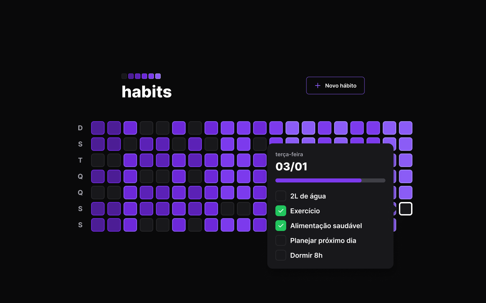

# Gerenciador de Hábitos
Gerenciador de Hábitos full-stack feito com React, TypeScript, Tailwind, Prisma e Fastify. Projeto desenvolvido durante o NLW Setup da RocketSeat



## ✨ Tecnologias
### Front-end
- Vite | React | TypeScript | TailwindCSS | Radix UI | Axios | dayjs | clsx | phosphor-react
### Back-end
- TypeScript | Fastify | Prisma | zod | dayjs |

## 🔖 Layout
Você pode visualizar o layout do projeto através [desse link](https://www.figma.com/file/PE52hpsQfYdC33xNR68ugN/Habits-(i)-(Community)?node-id=6%3A343&t=YN4cRYAhXe8Ka7u6-1).

## 💻 Uso
Em seu terminal:
```bash
# Clone o repositório
git clone https://github.com/ViGF/habits.git
# Acesse a pasta back-end do projeto
cd habits/server
# Instale as dependências
npm i
# Execute a aplicação
npm run dev
```
```bash
# Em outra janela do seu terminal acesse a pasta do front-end do projeto
cd ../client
# Instale as dependências
npm i
# Execute a aplicação
npm run dev
# Agora basta acessa-la
```